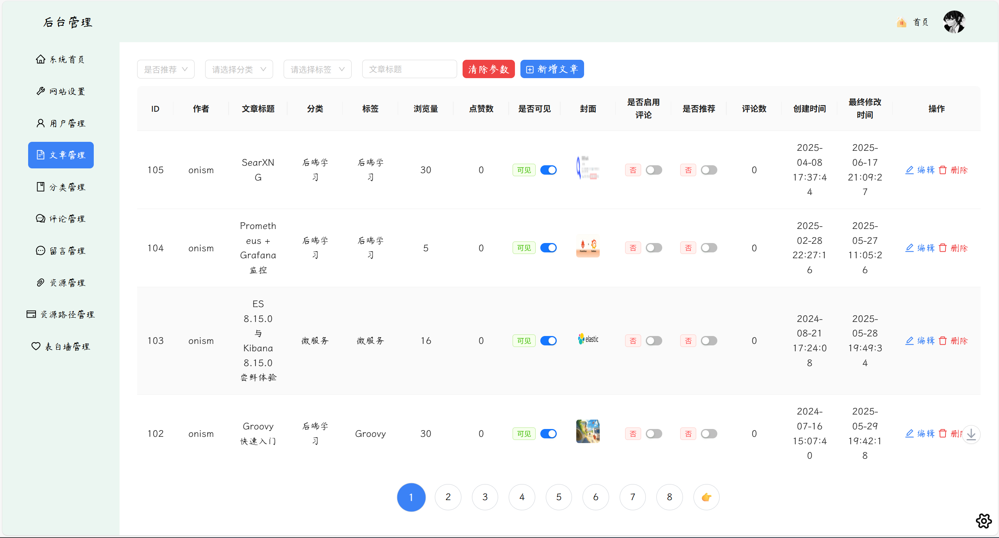
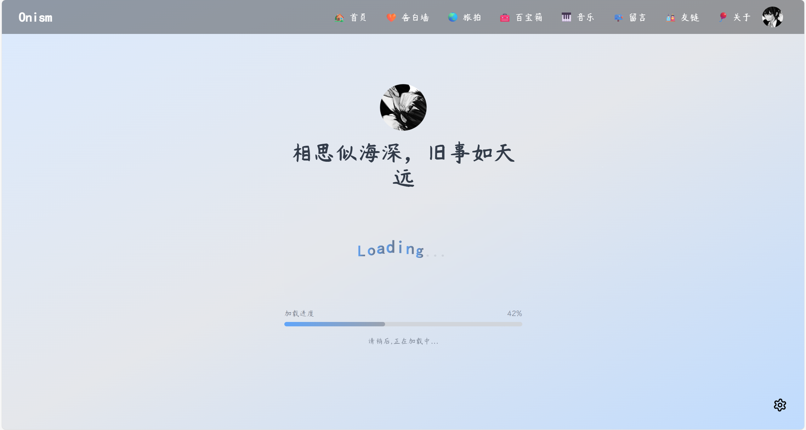
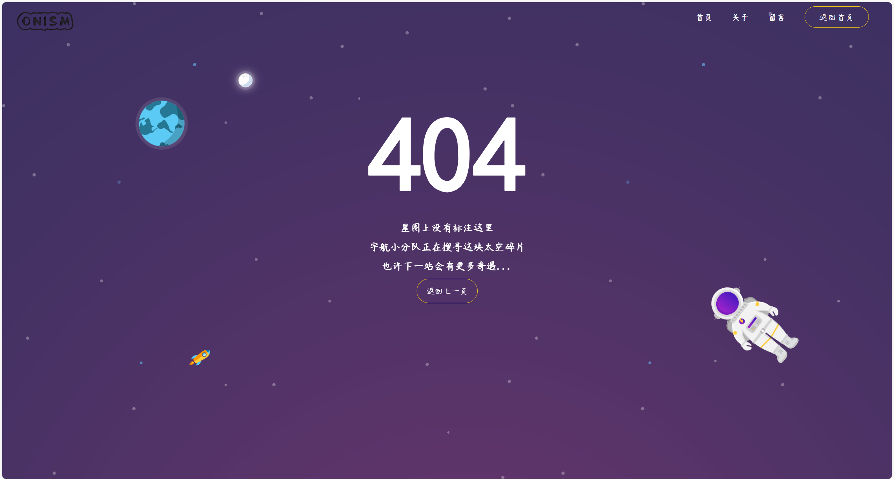

# Blog React
[](https://reactjs.org/)
[](https://www.typescriptlang.org/)
[](https://vitejs.dev/)
[](https://reactrouter.com/)
[](https://ant.design/)
[](https://tailwindcss.com/)
[](https://www.framer.com/motion/)
[](https://nodejs.org/)
[](https://eslint.org/)
[](https://opensource.org/licenses/AGPL-3.0)

[中文](./README.md) | English

Introduction: A modern personal blog system built with React + Vite + TypeScript, featuring Ant Design components and Tailwind CSS styling (Blog site: [onism.cn](https://onism.cn), welcome to visit, please don't attack me (ToT)/~~~)

## 🎨 Preface

### 🧨 Personal Story

During the summer of 2023, I decided to build my own personal blog to share my thoughts and essays. On one hand, I wanted to familiarize myself with frontend-backend interactions and deployment processes (including server configuration, domain registration and filing, SSL certificates and HTTPS configuration...). On the other hand, I was looking for something productive to do (~~got tired of gaming, nothing else to do~~).

So I started searching for open-source blog frontend code on the internet (mainly on GitHub and Gitee), as I'm primarily a backend developer. I found several that looked promising, but they either lacked documentation or were no longer maintained, which was discouraging...

After searching for a while, I finally found [Most Beautiful Blog (Challenge Most Beautiful Blog)](https://gitee.com/littledokey/poetize-vue2) on Gitee (author's site: [poetize.cn](https://poetize.cn)). The interface was beautiful, the features were comprehensive, and the author was still actively maintaining it with a community chat group. That's where my journey began...

### 🤯 Frontend Dream
Through documentation and guidance from the community experts, along with searching for solutions to various problems online (development is about discovering problems, solving problems, and creating new problems ~~just kidding~~), I finally got the blog code deployed after much effort. I was quite happy about it.

So why did I want to refactor the blog using React and TypeScript?

One day, I had a sudden inspiration to add a music player to my blog's homepage (calling random music APIs to implement music playback functionality). However, due to my insufficient understanding of JavaScript's weak typing characteristics (I was used to strongly-typed languages in backend development, so not specifying types often left me confused about variable types), and being a frontend newbie at the time, I often spent hours debugging because of unclear variable types. I was particularly tormented by those recurring `undefined` errors (no language/technology is superior to another, I was just too inexperienced back then QAQ).

Considering that I might add more of my whimsical ideas to the blog later (although I'm a backend developer, I've always had a frontend dream), I decided that short-term pain was better than long-term pain. After researching, I chose to refactor the blog using mainstream frameworks like React, TypeScript, Tailwind CSS, and Ant Design (writing TypeScript gave me a feeling similar to writing backend code).

However, due to various factors like other project plans, competitions, internships, etc., this task kept getting postponed. It wasn't until this year that I finally had substantial personal time to address this "concern".

In recent years, AI has become increasingly intelligent, and using it to assist development has significantly improved efficiency (60% of this refactoring was thanks to AI; things that might have taken a long time to learn before can now be achieved through AI interaction and fine-tuning, while also explaining the reasoning behind the approach, lowering the technical barrier). It only took me just over a month to complete.

### 🔎 Key Differences
The refactored version is based on the version I obtained at that time (2023.x version, relatively outdated compared to the current version by the [poetize](https://poetize.cn) author), so some features are missing. Since my initial purpose for the blog was to post my notes and essays, I didn't implement the IM (Instant Messaging) section, only refactoring the frontend and backend management parts.

Since the frontend layout/animations were already beautiful and quite perfect, I maintained the original state during refactoring. The backend consists mostly of tables, but since articles and resource data are extensive, I uniformly adopted in-page scrolling tables + pagination. I also added light/dark theme toggle buttons to the backend management (using article management as an example, as shown below):



Additionally, I added quick action shortcuts to the backend "Welcome" page, along with different greetings for different time periods:


A loading animation page was added for transitions between frontend page switches:



The following optimizations were also implemented:

- Added 404 Not Found page to avoid blank screen issues when incorrect routes are entered
  

- Fixed blank screen/error issues that could occur when viewing articles with incorrect article IDs (solution: redirect to 404 page)

### 🧐 Future Plans

Todo list:

- [ ] Complete refactoring of the "Love Wall" frontend page (currently not needed, so not refactored yet, opens to 404 page)
- [ ] Configuration management functionality (e.g., navbar configuration, footer information can be directly configured through backend without manually modifying code)
- [ ] Integration of virtual assistant (Live2D character)
- [ ] AI chat/search integration (considering fusion with virtual assistant)
- [ ] AI article summary/infographic/streamlined version (helping readers quickly extract key article information)
- [ ] Fix potential bugs (welcome everyone to submit issues)
- [ ] Support Docker one-click deployment (lazy person's essential)
- [ ] Other imaginative ideas (haven't thought of any yet, placeholder for now)
- ...

I'll be preparing for campus recruitment (autumn/spring recruitment) next, so there might be breaks in updates/maintenance. Once I land a job, I'll promptly address existing issues and prepare for upcoming plans.

## 🚀 Project Features

- **Tech Stack**: React 18 + Vite + TypeScript
- **Component Library**: Ant Design 5.x
- **Styling Solution**: Tailwind CSS + Custom Theme
- **Routing**: React Router DOM 6.x
- **State Management**: Custom Store Hook
- **Theme Switching**: Light/Dark theme support
- **Markdown Support**: Integrated Markdown editor and renderer
- **Code Highlighting**: Multi-language syntax highlighting
- **Responsive Design**: Multi-device screen adaptation
- **Type Safety**: Complete TypeScript type definitions
- **Code Standards**: ESLint + TypeScript ESLint standards

## 📦 Tech Stack

### Core Framework
- **React**: ^18.3.1
- **Vite**: ^5.4.1
- **TypeScript**: ^5.5.3

### UI Component Library
- **Ant Design**: ^5.21.2
- **Ant Design Icons**: ^5.5.1
- **React Icons**: ^5.5.0
- **Lucide React**: ^0.503.0

### Styling Solution
- **Tailwind CSS**: ^3.4.10
- **Tailwind Typography**: ^0.5.16
- **PostCSS**: ^8.4.43
- **Autoprefixer**: ^10.4.20

### Routing and State
- **React Router DOM**: ^6.26.2
- **Custom Store Hook**: Based on React Context

### Markdown Related
- **MD Editor RT**: ^5.7.0 (Markdown Editor)
- **React Markdown**: ^10.1.0 (Markdown Rendering)
- **React Syntax Highlighter**: ^15.6.1 (Code Highlighting)
- **Remark/Rehype Plugins**: Support for GFM, math formulas, etc.

### Utility Libraries
- **Axios**: ^1.7.7 (HTTP Client)
- **Lodash**: ^4.17.21 (Utility Functions)
- **QS**: ^6.13.0 (Query String Processing)
- **Framer Motion**: ^12.13.0 (Animation Library)

### Development Tools
- **ESLint**: ^9.9.0
- **TypeScript ESLint**: ^8.0.1
- **React Hooks ESLint**: ^5.1.0-rc.0

## 🏗️ Project Structure

<details open>

<summary>Quick overview (click to collapse/expand)</summary>

```
blog-react/
├── .github/                       # GitHub repository configuration files
│   ├── ISSUE_TEMPLATE/            # Issue template folder
│   │   ├── bug_report.yml         # Bug report form template
│   │   ├── config.yml             # Issue selector configuration
│   │   └── feature_request.yml    # Feature request form template
│   └── workflows/                 # GitHub Actions workflow folder
│       ├── comment-notifier.yml   # New reply email notification workflow
│       ├── issue-notifier.yml     # New issue email notification workflow
│       └── stale-closer.yml       # Auto-close inactive issues workflow
├── public/                 # Static assets
├── src/
│   ├── api/               # API interface definitions (backend interfaces)
│   │   ├── article.ts     # Article-related interfaces
│   │   ├── comment.ts     # Comment-related interfaces
│   │   ├── user.ts        # User-related interfaces
│   │   └── ...
│   ├── assets/            # Static resources
│   │   ├── css/           # Style files
│   │   ├── fonts/         # Font files (font.woff2 is same as poetize.cn)
│   │   ├── img/           # Image resources
│   │   └── svg/           # SVG icons
│   ├── components/        # Common components
│   │   ├── admin/         # Admin backend components
│   │   ├── comment/       # Comment components
│   │   ├── common/        # Common components
│   │   └── music/         # Music components
│   ├── hooks/             # Custom Hooks
│   │   ├── storage/       # Storage-related hooks
│   │   ├── useAppContext.tsx
│   │   ├── useRouter.tsx  # Router hook
│   │   ├── useStore.tsx
│   │   └── useThemeMode.tsx # Theme mode hook
│   ├── pages/             # Page components
│   │   ├── admin/         # Admin backend pages
│   │   ├── error/         # Error pages
│   │   ├── Home.tsx       # Homepage
│   │   ├── Article.tsx    # Article detail
│   │   ├── About.tsx      # About page
│   │   └── ...
│   ├── type/              # TypeScript type definitions (equivalent to backend entity/vo classes)
│   │   ├── article.d.ts   # Article types
│   │   ├── user.d.ts      # User types
│   │   ├── base.d.ts      # Base (pagination) types
│   │   └── ...
│   ├── utils/             # Utility functions
│   │   ├── request.ts     # HTTP request wrapper
│   │   ├── common.ts      # Common utilities
│   │   ├── time.ts        # Time processing
│   │   └── ...
│   ├── App.tsx            # Root component
│   ├── AppContent.tsx     # App content component
│   └── main.tsx           # App entry point
├── .env.development       # Development environment config
├── .env.production        # Production environment config
├── eslint.config.js       # ESLint configuration
├── tailwind.config.js     # Tailwind CSS configuration
├── tsconfig.json          # TypeScript configuration
├── vite.config.ts         # Vite configuration
└── package.json           # Project dependencies
```

</details>

## 🛠️ Development Environment Setup

### Requirements
- Node.js >= 18.0.0 (developed with v22.8.0)
- npm >= 8.0.0 or yarn >= 1.22.0

### Install Dependencies

```bash
# Clone the project
git clone https://github.com/OnismExplorer/blog-react.git
cd blog-react

# Install dependencies
npm install
# or
yarn install
```

### Environment Configuration

There are two environment configuration files in the project root directory. `.env.development` is for local development/testing environment, and `.env.production` is for production (server) environment.

These files are used to configure the backend service API addresses.

Therefore, the `.env.development` file contains addresses like localhost/127.0.0.1/192.168.xx.xx (LAN IP, needed for mobile testing in LAN, otherwise cannot access backend service),
while the `.env.production` file contains **server IP address**/domain (if available), etc.

> **.env.development** file

```env
# Development environment - Backend API base URL
VITE_BASE_URL=http://localhost:8081
VITE_WEB_URL=http://localhost
```

> **.env.production** file

```env
# Production environment - Backend API base URL (/api should be included, for nginx configuration, replace localhost with corresponding server IP/domain)
VITE_BASE_URL=http://localhost:8081/api
VITE_WEB_URL=http://localhost
```

### Start Development Server

```bash
npm run dev
# or
yarn dev
```

Visit [http://localhost:80](http://localhost:80) to view the website (if backend service is not started, data cannot be fetched and an "Error occurred" prompt will appear)

## 📝 Available Scripts

```bash
# Start development server (local development)
npm run dev

# Build production version: First execute TypeScript project reference batch build, then execute Vite packaging
npm run build

# Type checking: "Only do type checking, no output files", commonly used in CI or pre-commit
npm run type-check

# Code checking: Full project ESLint check, can be linked with Prettier for formatting (relatively strict, won't let warnings pass)
npm run lint

# Preview production build: Preview static files built by build (first run npm run build to generate dist files, then execute this command, usually used for preview checking before production deployment), typically runs on http://localhost:4173
npm run preview
```

The most important commands are `npm run dev` and `npm run build`, the former is for local running and the latter is for building.

## 🎨 Theme Configuration

The project supports light/dark theme switching, theme configuration is located at:

- **Tailwind Theme**: `tailwind.config.js`
- **Ant Design Theme**: `src/AppContent.tsx`
- **CSS Variables**: `src/assets/css/index.css`

### Custom Colors

CSS variables defined in `tailwind.config.js`:

```css
:root {
  --background: #ffffff;
  --fontColor: #333333;
  --borderColor: #e5e5e5;
  /* ... more variables */
}

.dark {
  --background: #1a1a1a;
  --fontColor: #ffffff;
  --borderColor: #404040;
  /* ... dark theme variables */
}
```

## 📱 Feature Modules

### Frontend Features
- **Homepage**: Article list, recommended articles
- **Article Detail**: Markdown rendering, comment system
- **Category Page**: Browse articles by category
- **About Page**: Personal introduction
- **Friends Page**: Friend links
- **Guestbook**: Visitor messages
- **Moments**: Short text sharing
- **Fun**: Humorous content
- **Travel**: Travel records
- **Collection**: Collected content
- **Love Wall**: Emotional records (to be completed)

### Backend Management
- **Article Management**: Create, edit, delete articles
- **Comment Management**: Comment moderation, replies
- **User Management**: User information management
- **Category Management**: Article category management
- **Resource Management**: File upload management
- **Site Settings**: Basic information configuration
- ...(Configuration management will be introduced later)

## 🔧 Configuration Guide

### Vite Configuration

- **Port**: Specify port 80, if HTTPS is enabled, it needs to be adjusted to 443

```ts
// vite.config.ts
// for http
server: {
    port: 80, // Specify port: 80
    ...
}

// for https
server: {
    port: 443, // Need to change to 443
    ...
}
```

- **Path Aliases**: Support for `@` prefixed path aliases
- **Environment Variables**: Multi-environment configuration support
- **Build Optimization**: Remove console and debugger in production

### TypeScript Configuration

- **Strict Mode**: Enable all strict type checking
- **Path Mapping**: Support absolute path imports
- **Target Version**: ES2023

### ESLint Configuration

- **React Hooks**: Enforce Hooks usage standards
- **TypeScript**: TypeScript-specific rules
- **Code Style**: Unified code formatting

## 🚀 Deployment

### Build Production Version

```bash
npm run build
```

Build files will be output to the `dist` directory.

### Deploy to Server

1. Upload the `dist` directory to the server
2. Configure web server (Nginx/Apache)
3. Set correct environment variables

### Nginx Configuration Example
Here are two scenarios: HTTP and HTTPS

> Using HTTP

<details open>

<summary>Click to collapse/expand code</summary>

```nginx
server {
    listen 80; # Listen to HTTP requests on port 80
    server_name example.com; # Domain/IP
    root /path/to/dist; # Website root directory, location of extracted dist directory
    index  index.html index.htm;  # Default homepage files

    location / {
        root       /path/to/dist; # Frontend path
        index index.html;
        try_files $uri $uri/ /index.html;
    }

    # Proxy requests with /api/ prefix to backend service
    location /api/ {
      rewrite           ^/api/(.*)$ /$1 break; # Remove /api/ prefix from URI
      proxy_pass        http://127.0.0.1:8081; # Backend service address
      proxy_redirect    off;
      proxy_set_header  Host $host; # Forward client's Host header to backend
      proxy_set_header  X-real-ip $remote_addr; # Forward client's real IP to backend
      proxy_set_header  X-Forwarded-For $proxy_add_x_forwarded_for; # Forward all proxy IPs to backend for tracing
    }
    
    # Static resource caching (optional)
    location ~* \.(css|js|png|jpg|jpeg|gif|svg|ico)$ {
        expires 30d;                      # Cache for 30 days
        access_log off;                   # Don't log such requests
        error_log    off;
    }
    
    # js/css resource caching (optional)
    location ~* \.(js|css)(\?.*)?$ {
        expires      12h; # Cache for 12 hours
        access_log   off;
        error_log    off;
    }
}
```

</details>

> Using HTTPS

<details open>

<summary>Click to collapse/expand code</summary>

```nginx
server {
    listen 443 ssl http2; # Listen to HTTPS requests on port 443
    server_name example.com; # Domain/IP
    root /path/to/dist; # Website root directory, location of extracted dist directory
    index  index.html index.htm;  # Default homepage files

    ssl_certificate     /path/to/fullchain.pem; # SSL certificate location
    ssl_certificate_key /path/to/privkey.pem; # Private key location

    location / {
        root       /path/to/dist; # Frontend path
        index index.html;
        try_files $uri $uri/ /index.html;
    }

    # Proxy requests with /api/ prefix to backend service
    location /api/ {
      rewrite           ^/api/(.*)$ /$1 break; # Remove /api/ prefix from URI
      proxy_pass        http://127.0.0.1:8081; # Backend service address
      proxy_redirect    off;
      proxy_set_header  Host $host; # Forward client's Host header to backend
      proxy_set_header  X-real-ip $remote_addr; # Forward client's real IP to backend
      proxy_set_header  X-Forwarded-For $proxy_add_x_forwarded_for; # Forward all proxy IPs to backend for tracing
    }
    
    # Static resource caching (optional)
    location ~* \.(css|js|png|jpg|jpeg|gif|svg|ico)$ {
        expires 30d;                      # Cache for 30 days
        access_log off;                   # Don't log such requests
        error_log    off;
    }
    
    # js/css resource caching (optional)
    location ~* \.(js|css)(\?.*)?$ {
        expires      12h; # Cache for 12 hours
        access_log   off;
        error_log    off;
    }
}

# Force HTTP to HTTPS redirect (optional)
server {
    listen      80;
    server_name example.com www.example.com;
    return      301 https://$host$request_uri;
}
```

</details>

If using [BT Panel](https://www.bt.cn/new/index.html) for deployment, SSL certificates can be directly managed there.

### Additional Notes

1. In `@components/common/footer.tsx`, you need to change the `ICP registration number` to the actual registration number (for domestic domain registration)
2. The project uses Qiniu Cloud CDN storage, which requires self-registration and configuration: [Qiniu Cloud](https://www.qiniu.com/)
3. After successful deployment, the backend management address is: [http://localhost/admin](http://localhost/admin) (this is an example for development environment; for production environment, replace `http://localhost` with the corresponding protocol + IP/domain)
4. The backend code used by the project is not directly taken from [poetize.cn](https://poetize.cn)'s backend code but has been modified to some extent (most API endpoints match). It's currently not open-sourced (will be open-sourced later), so the backend can be developed independently for now.

## 🤝 Contributing

1. Fork this repository
2. Create a feature branch (`git checkout -b feature/AmazingFeature`)
3. Commit your changes (`git commit -m 'Add some AmazingFeature'`)
4. Push to the branch (`git push origin feature/AmazingFeature`)
5. Open a Pull Request

`AmazingFeature` above is a placeholder for the feature name.

> Commit Message Convention

```yaml
feat(login): add xxx login functionality
fix(api): fix xxx API issue
docs(readme): update readme documentation
```

feat (new feature), fix (bug fix), docs (documentation update) are types, content in parentheses is the scope of impact, and after the colon is a brief description.

Each commit should only contain one type of change, avoiding mixing logic changes, new features, and documentation in a single commit.

### Code Standards

- Follow ESLint rules
- Use TypeScript for type annotations
- Use functional components + Hooks
- Prioritize Tailwind CSS for styling
- Follow Conventional Commits for commit messages

## 🙏 Acknowledgments

- **[poetize.cn](https://poetize.cn)** - **Most Beautiful Blog**
- [React](https://reactjs.org/) - A JavaScript library for building user interfaces
- [Vite](https://vitejs.dev/) - Next generation frontend tooling
- [md-editor-rt](https://github.com/imzbf/md-editor-rt) - A powerful, highly extensible Markdown editor component
- [Ant Design](https://ant.design/) - Enterprise-class UI design language
- [Tailwind CSS](https://tailwindcss.com/) - A utility-first CSS framework
- [TypeScript](https://www.typescriptlang.org/) - JavaScript with syntax for types

## 📞 Contact

For questions or suggestions, please contact via:

- Website: [onism.cn](https://onism.cn)
- Email: [onism.cn@gmail.com](mailto:onism.cn@gmail.com)
- Submit an [issue](https://github.com/OnismExplorer/blog-react/issues/new)

---

## ✨ Conclusion
⭐ If this project helps you, please consider giving it a Star! q(≧▽≦q) Much appreciated!

Special thanks to [poetize.cn](https://poetize.cn) and all the contributors for their open-source sharing and dedication (strongly support them~)

Welcome to fork this project, and I hope you can promptly submit issues when you find problems, making this project better and better!
