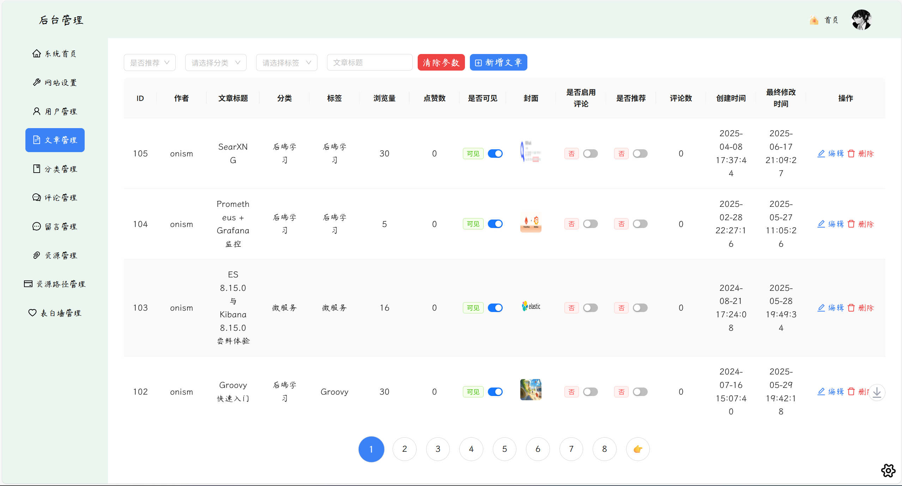
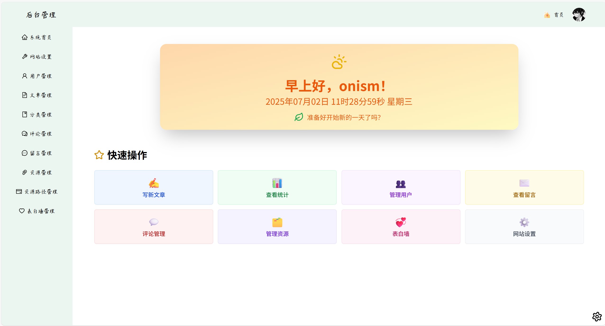
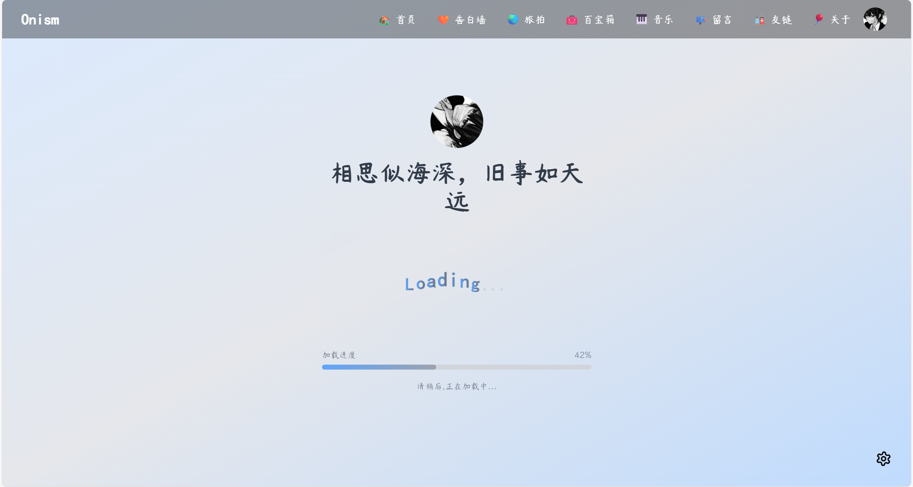
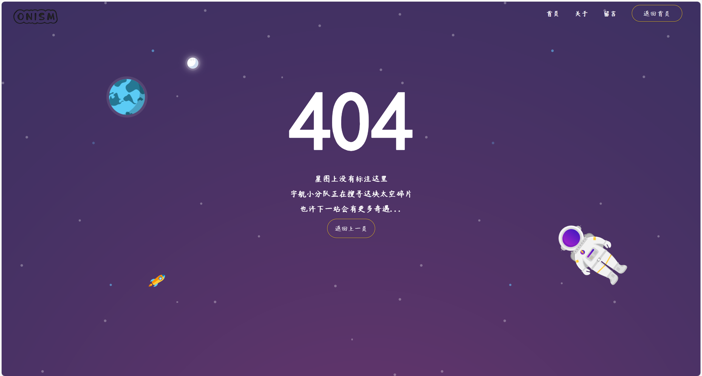

# Blog React
[](https://reactjs.org/)
[](https://www.typescriptlang.org/)
[](https://vitejs.dev/)
[](https://reactrouter.com/)
[](https://ant.design/)
[](https://tailwindcss.com/)
[](https://www.framer.com/motion/)
[](https://nodejs.org/)
[](https://eslint.org/)
[](https://opensource.org/licenses/AGPL-3.0)

中文 | [English](./README-EN.md)

简介：一个基于 React + Vite + TypeScript 构建，采用 Ant Design 组件库和 Tailwind CSS 样式框架的现代化个人博客系统(博客地址：[onism.cn](https://onism.cn)，欢迎参观，补药攻击我呀 (ToT)/~~~)

## 🎨写在前面

### 🧨碎碎念

在 2023 年的暑假，准备搭建一个自己的个人博客发发随笔，一方面想熟悉一下前后端的交互过程，以及上线的流程(包括服务器配置、域名的购买备案、SSL 证书与 HTTPS 配置...)，另一方面也是想给自己找点事干(~~游戏打腻了，没事干~~)

于是便开始在网上(主要是 github 和 gitee)上寻找开源的博客前端代码(本人是后端 er)，找了几个看着不错的，但要么是文档不全，要么就是不维护了，总之劝退了...

寻找了一段时间，直到在 gitee 上找到了 [最美博客(挑战最美博客)](https://gitee.com/littledokey/poetize-vue2)(作者网站：[poetize.cn](https://poetize.cn))，页面很好看，功能很全面，同时作者仍然在积极更新维护，还有交流群，于是故事便开始了...

### 🤯 前端梦
通过群里大佬的文档和指导，同时在网上寻找资料解决遇到的各种各样的问题(开发就是发现问题，解决问题，写出问题 ~~bushi~~)，折腾好一阵，终于是将博客代码上线了，很是开心

那么为什么我会想着自己再用 React 和 ts 重构一遍博客呢？

有一次突发奇想，想着给自己的博客首页加一个音乐播放器(调用随机音乐 API，实现音乐播放功能)，但是因为对 js 弱类型特性认识不足(后端用的是强类型语言，所以不指定类型很容易绕晕忘记该变量之前是什么类型)，当时还是个前端小白，常常因为变量类型不明确而调试半天，所以遇到很多问题，尤其被那些反复出现的 `undefined` 折磨得焦头烂额(语言/技术不分高低，单纯是当时自己太菜了 QAQ)

考虑到后面可能还会在上面加自己的各种奇思妙想(虽然是后端 er，但内心一直有个前端梦)，长痛不如短痛，搜集资料，决定用 React,ts,tailwindcss,AntDesign 这些主流框架重构博客(写 ts 的时候给我一种在写后端的感觉)

但是后面因为其他项目规划、比赛、实习等等各种因素，导致这件事一直搁浅。直到今年终于是有大块属于自己的时间，来解决这块“心病”

近几年 AI  变的越来越聪明，用来辅助开发，效率提高了不少(这次重构有 60% 是 AI 的功劳，之前可能要学很久的东西，现在通过跟 AI 交流微调一下就能达到想要的效果，同时也会给出为什么这么做的原因，弱化了技术门槛)，只用了一个多月就搞定了

### 🔎 差异点
重构的版本是当时拿到的那个版本(2023.x 的版本，与现在 [poetize](https://poetize.cn) 作者的版本相对比较落后)，所以有些功能是没有的，因为本人做博客的初衷是在上面发发自己的笔记和随笔，所以也没有做 IM 部分，只重构了前台和后台部分

因为前台本身布局/动画都很好看，比较完美，所以重构时保持的原有的状态。后台大多都是表格，不过文章和资源数据比较多，所以统一采用了页内滚动表格+分页的形式，同时给后台也加上了明暗主题切换的按钮(以文章管理为例，如下图)



同时，后台“欢迎”页面加上了快捷操作跳转，以及各个时间段不同的问候语



前台页面切换时添加了一个加载动画页面进行过度



同时还进行了以下优化：

- 添加 404 Not Found 页面，避免路由输入错误而导致页面白屏问题


- 修复查看文章时，可能因文章 id 输入错误时，导致的页面白屏/报错问题(解决办法是跳转至 404 页面)

### 🧐后续计划

计划清单：

- [ ] 完成“表白墙”前台页面的重构(因目前暂时用不到，所以暂时没有重构，打开为 404 页面)
- [ ] 配置管理功能(例如导航栏配置，页脚信息等可以直接通过后台配置，无需手动修改代码)
- [ ] 接入看板娘
- [ ] 接入 AI 聊天/搜索(考虑与看板娘融合)
- [ ] 文章的 AI 总结/一图流/省流版(帮助读者快速提取文章关键信息)
- [ ] 修复潜在的 bug(欢迎大家提 issue)
- [ ] 支持 Docker 一键式部署(懒人必备)
- [ ] 其他天马行空的想法(暂时没有想到，放这里当占位符)
- ...

后面要开始着手准备校招(秋招/春招)的事情，可能会断更/停止维护一段时间，等到上岸了会及时解决存在的问题，和准备接下来的计划

## 🚀 项目特性

- **技术栈**: React 18 + Vite + TypeScript
- **组件库**: Ant Design 5.x
- **样式方案**: Tailwind CSS + 自定义主题
- **路由管理**: React Router DOM 6.x
- **状态管理**: 自定义 Store Hook
- **主题切换**: 支持明暗主题切换
- **Markdown 支持**: 集成 Markdown 编辑器和渲染器
- **代码高亮**: 支持多种编程语言语法高亮
- **响应式设计**: 适配多种设备屏幕
- **类型安全**: 完整的 TypeScript 类型定义
- **代码规范**: ESLint + TypeScript ESLint 规范

## 📦 技术栈

### 核心框架
- **React**: ^18.3.1
- **Vite**: ^5.4.1
- **TypeScript**: ^5.5.3

### UI 组件库
- **Ant Design**: ^5.21.2
- **Ant Design Icons**: ^5.5.1
- **React Icons**: ^5.5.0
- **Lucide React**: ^0.503.0

### 样式方案
- **Tailwind CSS**: ^3.4.10
- **Tailwind Typography**: ^0.5.16
- **PostCSS**: ^8.4.43
- **Autoprefixer**: ^10.4.20

### 路由和状态
- **React Router DOM**: ^6.26.2
- **自定义 Store Hook**: 基于 React Context

### Markdown 相关
- **MD Editor RT**: ^5.7.0 (Markdown 编辑器)
- **React Markdown**: ^10.1.0 (Markdown 渲染)
- **React Syntax Highlighter**: ^15.6.1 (代码高亮)
- **Remark/Rehype 插件**: 支持 GFM、数学公式等

### 工具库
- **Axios**: ^1.7.7 (HTTP 客户端)
- **Lodash**: ^4.17.21 (工具函数)
- **QS**: ^6.13.0 (查询字符串处理)
- **Framer Motion**: ^12.13.0 (动画库)

### 开发工具
- **ESLint**: ^9.9.0
- **TypeScript ESLint**: ^8.0.1
- **React Hooks ESLint**: ^5.1.0-rc.0

## 🏗️ 项目结构

<details open>

<summary>简单的看一下(点击折叠/展开)</summary>

```
blog-react/
├── .github/                       # GitHub 仓库配置文件
│   ├── ISSUE_TEMPLATE/            # Issue 模板文件夹
│   │   ├── bug_report.yml         # Bug 反馈表单模板
│   │   ├── config.yml             # Issue 选择器配置
│   │   └── feature_request.yml    # 功能建议表单模板
│   └── workflows/                 # GitHub Actions 工作流文件夹
│       ├── comment-notifier.yml   # 新回复邮件通知作者工作流
│       ├── issue-notifier.yml     # 新 Issue 邮件通知维护者工作流
│       └── stale-closer.yml       # 自动关闭不活跃 Issue 工作流
├── public/                 # 静态资源
├── src/
│   ├── api/               # API 接口定义(后端接口)
│   │   ├── article.ts     # 文章相关接口
│   │   ├── comment.ts     # 评论相关接口
│   │   ├── user.ts        # 用户相关接口
│   │   └── ...
│   ├── assets/            # 静态资源
│   │   ├── css/           # 样式文件
│   │   ├── fonts/         # 字体文件(其中 font.woff2 为 poetize.cn 同款字体)
│   │   ├── img/           # 图片资源
│   │   └── svg/           # SVG 图标
│   ├── components/        # 公共组件
│   │   ├── admin/         # 管理后台组件
│   │   ├── comment/       # 评论组件
│   │   ├── common/        # 通用组件
│   │   └── music/         # 音乐组件
│   ├── hooks/             # 自定义 Hooks
│   │   ├── storage/       # 存储相关 Hook
│   │   ├── useAppContext.tsx
│   │   ├── useRouter.tsx # 路由 Hook
│   │   ├── useStore.tsx
│   │   └── useThemeMode.tsx # 主题模式 Hook
│   ├── pages/             # 页面组件
│   │   ├── admin/         # 管理后台页面
│   │   ├── error/         # 错误页面
│   │   ├── Home.tsx       # 首页
│   │   ├── Article.tsx    # 文章详情
│   │   ├── About.tsx      # 关于页面
│   │   └── ...
│   ├── type/              # TypeScript 类型定义(相当于后端的 entity/vo 实体类)
│   │   ├── article.d.ts   # 文章类型
│   │   ├── user.d.ts      # 用户类型
│   │   ├── base.d.ts      # 基础(分页)类型
│   │   └── ...
│   ├── utils/             # 工具函数
│   │   ├── request.ts     # HTTP 请求封装
│   │   ├── common.ts      # 通用工具
│   │   ├── time.ts        # 时间处理
│   │   └── ...
│   ├── App.tsx            # 根组件
│   ├── AppContent.tsx     # 应用内容组件
│   └── main.tsx           # 应用入口
├── .env.development       # 开发环境配置
├── .env.production        # 生产环境配置
├── eslint.config.js       # ESLint 配置
├── tailwind.config.js     # Tailwind CSS 配置
├── tsconfig.json          # TypeScript 配置
├── vite.config.ts         # Vite 配置
└── package.json           # 项目依赖
```

</details>

## 🛠️ 开发环境搭建

### 环境要求
- Node.js >= 18.0.0(开发用的是 v22.8.0)
- npm >= 8.0.0 或 yarn >= 1.22.0

### 安装依赖

```bash
# 克隆项目
git clone https://github.com/OnismExplorer/blog-react.git
cd blog-react

# 安装依赖
npm install
# 或
yarn install
```

### 环境配置

在项目根目录下有两个环境配置文件，`.env.development` 为(本地)开发测试环境中的环境配置文件，`.env.production` 为生产(服务器)环境中的配置文件

这两个文件用于配置后端服务的 API 地址

因此 `.env.development` 文件中地址为(这里忽略了端口) localhost/127.0.0.1/192.168.xx.xx(局域网中的 IP，用手机局域网测试移动端时则需要使用这个，否则无法访问后端服务)，
而 `.env.production`文件中地址为**服务器 IP 地址**/域名(若有)等

> **.env.development** 文件

```env
# 开发环境-后端 API 的基础 URL
VITE_BASE_URL=http://localhost:8081
VITE_WEB_URL=http://localhost
```

> **.env.production** 文件

```env
# 生产环境-后端 API 的基础 URL(/api要带上，对于后面 nginx 中的配置，将 localhost 换成对应的服务器 IP /域名)
VITE_BASE_URL=http://localhost:8081/api
VITE_WEB_URL=http://localhost
```


### 启动开发服务器

```bash
npm run dev
# 或
yarn dev
```

访问 [http://localhost:80](http://localhost:80) 查看网页(如果没有启动后端服务，则无法拉起数据，而弹出`发生错误`提示)

## 📝 可用脚本

```bash
# 启动开发服务器(本地开发)
npm run dev

# 构建生产版本：先执行 TypeScript 项目引用的批量构建，再执行 Vite 打包
npm run build

# 类型检查：“只做类型校验，不输出任何文件”，常用于 CI 或 pre‑commit
npm run type-check

# 代码检查：全项目 ESLint 检查，可配合 Prettier 联动格式化(相对严格，warning 都不会放过)
npm run lint

# 预览生产构建：预览 build 出来的静态文件(首先要运行 npm run build 生成 dist 文件，再执行这个命令，通常用于部署到生产环境前的预览检查)，通常运行在 http://localhost:4173
npm run preview
```

最重要的是 `npm run dev` 和 `npm run build`命令 ，前者是本地运行命令，后者是打包命令
## 🎨 主题配置

项目支持明暗主题切换，主题配置位于：

- **Tailwind 主题**: `tailwind.config.js`
- **Ant Design 主题**: `src/AppContent.tsx`
- **CSS 变量**: `src/assets/css/index.css`

### 自定义颜色

在 `tailwind.config.js` 中定义的 CSS 变量：

```css
:root {
  --background: #ffffff;
  --fontColor: #333333;
  --borderColor: #e5e5e5;
  /* ... 更多变量 */
}

.dark {
  --background: #1a1a1a;
  --fontColor: #ffffff;
  --borderColor: #404040;
  /* ... 暗色主题变量 */
}
```

## 📱 功能模块

### 前台功能
- **首页**: 文章列表、推荐文章
- **文章详情**: Markdown 渲染、评论系统
- **分类页面**: 按分类浏览文章
- **关于页面**: 个人介绍
- **友链页面**: 友情链接
- **留言板**: 访客留言
- **微言**: 短文分享
- **搞笑**: 趣味内容
- **旅行**: 旅行记录
- **收藏**: 收藏内容
- **表白墙**: 情感记录(待完成)

### 后台管理
- **文章管理**: 创建、编辑、删除文章
- **评论管理**: 评论审核、回复
- **用户管理**: 用户信息管理
- **分类管理**: 文章分类管理
- **资源管理**: 文件上传管理
- **网站设置**: 基本信息配置
- ...(后续将引入配置管理)

## 🔧 配置说明

### Vite 配置

- **端口**: 指定端口 80，如果开通了 Https，则需要将其调整为 443 

```ts
// vite.config.ts
// http 时
server: {
    port: 80, // 指定端口号：80
    ...
}

// https 时
server: {
    port: 443, // 需要修改为 443
    ...
}

```
- **路径别名**: 支持 `@` 开头的路径别名
- **环境变量**: 支持多环境配置
- **构建优化**: 生产环境移除 console 和 debugger

### TypeScript 配置

- **严格模式**: 启用所有严格类型检查
- **路径映射**: 支持绝对路径导入
- **目标版本**: ES2023

### ESLint 配置

- **React Hooks**: 强制 Hooks 使用规范
- **TypeScript**: TypeScript 专用规则
- **代码风格**: 统一代码格式

## 🚀 部署

### 构建生产版本

```bash
npm run build
```

构建文件将输出到 `dist` 目录。

### 部署到服务器

1. 将 `dist` 目录上传到服务器
2. 配置 Web 服务器（Nginx/Apache）
3. 设置正确的环境变量

### Nginx 配置示例
这里分两种情况，一种是 http，另一种是 https

> 使用 http


<details open>

<summary>点击折叠/展开代码</summary>

```nginx
server {
    listen 80; # 监听 80 端口的 HTTP 请求
    server_name example.com; #域名/IP
    root /path/to/dist; # 网站根目录，为解压后的 dist 目录所在位置
    index  index.html index.htm;  # 默认首页文件

    location / {
        root       /path/to/dist;#前端路径
        index index.html;
        try_files $uri $uri/ /index.html;
    }

    # 将 /api/ 前缀的请求代理到后端服务
    location /api/ {
      rewrite           ^/api/(.*)$ /$1 break; # 去掉 URI 中的 /api/ 前缀
      proxy_pass        http://127.0.0.1:8081; # 后端服务地址
      proxy_redirect    off;
      proxy_set_header  Host $host; # 将客户端请求的 Host 头转发给后端
      proxy_set_header  X-real-ip $remote_addr; # 将客户端真实 IP 转发给后端
      proxy_set_header  X-Forwarded-For $proxy_add_x_forwarded_for; # 将所有经过的代理 IP 也传给后端，便于链路追踪
    }
    
    # 静态资源缓存(可选)
    location ~* \.(css|js|png|jpg|jpeg|gif|svg|ico)$ {
        expires 30d;                      # 缓存 30 天
        access_log off;                   # 不记录此类请求日志
        error_log    off;
    }
    
    # js/css 资源缓存(可选)
    location ~* \.(js|css)(\?.*)?$ {
        expires      12h; # 缓存 12 小时
        access_log   off;
        error_log    off;
    }
}
```

</details>

> 使用 https 

<details open>

<summary>点击折叠/展开代码</summary>

``` nginx
server {
    listen 443 ssl http2; # 监听 80 端口的 HTTP 请求
    server_name example.com; #域名/IP
    root /path/to/dist; # 网站根目录，为解压后的 dist 目录所在位置
    index  index.html index.htm;  # 默认首页文件

    ssl_certificate     /path/to/fullchain.pem; # ssl 证书存放地址
    ssl_certificate_key /path/to/privkey.pem; # 私钥存放地址

    location / {
        root       /path/to/dist;#前端路径
        index index.html;
        try_files $uri $uri/ /index.html;
    }

    # 将 /api/ 前缀的请求代理到后端服务
    location /api/ {
      rewrite           ^/api/(.*)$ /$1 break; # 去掉 URI 中的 /api/ 前缀
      proxy_pass        http://127.0.0.1:8081; # 后端服务地址
      proxy_redirect    off;
      proxy_set_header  Host $host; # 将客户端请求的 Host 头转发给后端
      proxy_set_header  X-real-ip $remote_addr; # 将客户端真实 IP 转发给后端
      proxy_set_header  X-Forwarded-For $proxy_add_x_forwarded_for; # 将所有经过的代理 IP 也传给后端，便于链路追踪
    }
    
    # 静态资源缓存(可选)
    location ~* \.(css|js|png|jpg|jpeg|gif|svg|ico)$ {
        expires 30d;                      # 缓存 30 天
        access_log off;                   # 不记录此类请求日志
        error_log    off;
    }
    
    # js/css 资源缓存(可选)
    location ~* \.(js|css)(\?.*)?$ {
        expires      12h; # 缓存 12 小时
        access_log   off;
        error_log    off;
    }
}

# 将 HTTP 强制跳转到 HTTPS(可选)
server {
    listen      80;
    server_name example.com www.example.com;
    return      301 https://$host$request_uri;
}
```

</details>

如果是使用的[宝塔面板](https://www.bt.cn/new/index.html)部署，则 ssl 证书可以直接托管在上面

### 补充

1. `@components/common/footer.tsx` 中需要将 `ICP 备案号` 修改为真实的备案号(国内域名备案)
2. 项目中会使用的是七牛云 CDN 存储，需要自行注册配置一下：地址：[七牛云](https://www.qiniu.com/)
3. 部署成功后，后台管理地址为：[http://localhost/admin](http://localhost/admin)(这里是以开发环境为例，若是生产环境，将`http://localhost` 换成对应的协议+IP/域名即可)
4. 项目所用到的后端代码并非是直接搬用的 [poetize.cn](https://poetize.cn) 的后端代码，做了一定修改(大部分接口地址是匹配的)，目前并未开源出来(后面开源出来)，所以后端可以先自行开发

## 🤝 贡献指南

1. Fork 本仓库
2. 创建特性分支 (`git checkout -b feature/AmazingFeature`)
3. 提交更改 (`git commit -m 'Add some AmazingFeature'`)
4. 推送到分支 (`git push origin feature/AmazingFeature`)
5. 打开 Pull Request

上面的`AmazingFeature`是代指特性，

> 提交信息规范

```yaml
feat(login): 新增 xxx login 功能
fix(api): 修复 xxx API 问题
docs(readme): 更新 readme 文档
```

feat(新增功能)、fix(修复问题)、docs(文档更新) 是类型(type)，括号内是影响范围（scope），冒号后面写简短描述。

每次提交都只做一类(type)改动，避免在一次 commit 里同时写逻辑、新功能和文档
### 代码规范

- 遵循 ESLint 规则
- 使用 TypeScript 进行类型标注
- 组件使用函数式组件 + Hooks
- 样式优先使用 Tailwind CSS
- 提交信息遵循 Conventional Commits


## 🙏 致谢

- **[poetize.cn](https://poetize.cn)** - **最美博客**
- [React](https://reactjs.org/) - 用户界面库
- [Vite](https://vitejs.dev/) - 构建工具
- [md-editor-rt](https://github.com/imzbf/md-editor-rt) - 一个强大，拓展性很强的 Markdown 编辑器组件
- [Ant Design](https://ant.design/) - 企业级 UI 设计语言
- [Tailwind CSS](https://tailwindcss.com/) - 实用优先的 CSS 框架
- [TypeScript](https://www.typescriptlang.org/) - JavaScript 的超集

## 📞 联系方式

如有问题或建议，请通过以下方式联系：

- 网站: [onism.cn](https://onism.cn)
- 邮箱: [onism.cn@gmail.com](mailto:onism.cn@gmail.com)
- 提交 [issue](https://github.com/OnismExplorer/blog-react/issues/new)

---

## ✨结语
⭐ 如果这个项目对你有帮助，请麻烦动动小手点个 Star 吧~  q(≧▽≦q) 十分感谢！

同时衷心致谢 [poetize.cn](https://poetize.cn)，感谢各位大佬的开源分享与付出(强烈支持一波~)

欢迎小伙伴 fork ，同时也希望发现问题时能及时的提出 issue，让这个项目越来越好！
